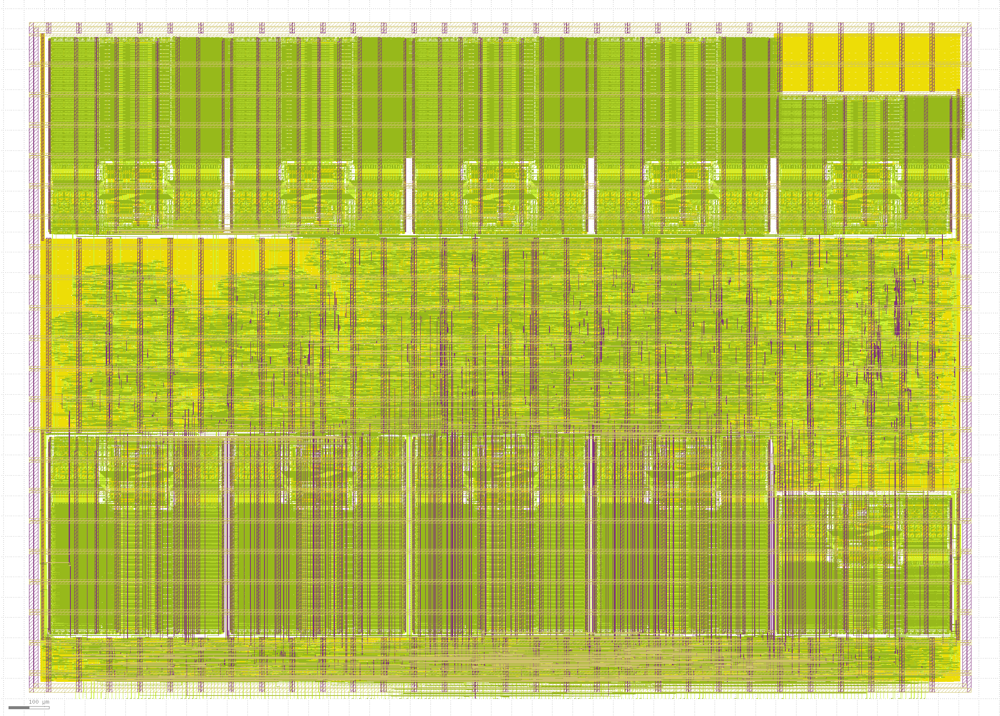

# `ppu` — Picture Processing Unit (GF180MCU-D)

Scanline-based 2D graphics processor and display controller fabricated in GlobalFoundries GF180MCU-D (5V nominal). The block implements two distinct, mutually exclusive front ends: a raster command processor that renders layered 2D display lists into on-chip line buffers, and a hardware scanout engine that serves as a zero-driver `simple-framebuffer` device for the Linux kernel's `simpledrm` subsystem.

Digital video output drives 640×480@59.52 Hz directly via digital RGB555 and discrete sync lines.

> **Attribution:** the architecture derives from the **RISCBoy PPU by Luke Wren** (Apache 2.0).
> [`NOTICE`](NOTICE) (in this folder) must accompany any redistribution. Full licence and
> derivation detail: [§11](#11-licence--attribution) below.

---

## 1. Top-Level Architectural Overview

```text
               +-------------------------------------------------------------+
               |                       External Memory                       |
               |       (Tilemaps, Texels, Display Lists, Framebuffers)       |
               +-------------------------------------------------------------+
                                       |                 |
                       16-bit Master   |                 | Burst Master
                       (Command Fetch) |                 | (Linear Scanout)
                                       v                 v
               +--------------------------------+  +-------------------------+
               |   Command / Raster Processor   |  |   Framebuffer Scanner   |
               | (Affine DDA, Unpack, Pal, Blt) |  |   (FB_CTRL.FB_EN = 1)   |
               +--------------------------------+  +-------------------------+
                                       \                 /
                                        \               / (Muxed Front-End)
                                         v             v
                                  +---------------------------+
                                  |  Dual Scanline Buffers    |
                                  |  (8x sram512x8, 2x Banks) |
                                  +---------------------------+
                                                |
                                                v (Pixel Doubling)
                                  +---------------------------+
                                  |   Display Controller /    |
                                  |   Programmable CRTC       |
                                  +---------------------------+
                                                |
                                                v
                                    Digital RGB555 + H/V Sync

```

* **Command Mode (2D Rasterizer):** Executes a compiled display list line-by-line into an internal line buffer. Two independently scrolled tiled playfields per scanline, 32 sprites evaluated per line with horizontal/vertical flip, affine texture mapping on any layer, five colour-blend modes, per-pixel priority, two clip windows, and optional per-tile flip and sub-palette. Layering and priority are the display-list order, re-read every scanline.
* **Scanout Mode (`simpledrm`):** Bypasses the 2D command pipeline to DMA linear memory directly into the line buffers. Meets all kernel requirements for `simple-framebuffer` without dedicated driver code.
* **Display Engine:** Reads the idle line buffer and streams doubled 640×480 scanlines at 25 MHz to off-chip video transmitters (DVI/HDMI/parallel RGB).

---

## 2. Silicon Metrics & Signoff Status

Hardened macro views are published in **this directory**, produced by a LibreLane
hardening flow (run `RUN_2026-08-18_23-14-37`; see [`PROVENANCE.md`](PROVENANCE.md)). The
RTL, golden model, testbenches and synthesis scripts ship alongside the views in
[`rtl/`](rtl), [`model/`](model), [`tb/`](tb) and [`scripts/`](scripts); only the
LibreLane flow configuration and run directories live in the upstream project
tree. This repository is the self-contained release and the suite runs from it.



*Layout at 1 px/µm: line-buffer bank0 + palette macro along the top, the 500 µm routed
logic channel across the middle, bank1 (rotated 180°, pins facing the channel) along the
bottom, pin-escape belt on the south edge.*

**Which view does what:** chip **synthesis** sees only `vh/ppu_top.vh` (empty blackbox,
`USE_POWER_PINS`-guarded — it does not simulate); **PnR** consumes `gds/` + `lef/` + `lib/`
through the integrating chip's macro registration (a LibreLane `MACROS` entry or
equivalent, listing GDS, LEF and per-corner liberty); **simulation** uses the
upstream behavioural RTL (identical port list) or `nl/ppu_top.nl.v` + `sdf/`
(gate-level); **firmware** talks to the macro purely through its APB3 slot — nothing else
is memory-mapped.

| Path | View |
| --- | --- |
| `gds/ppu_top.gds` | Merged tapeout layout (SRAM macros instantiated) |
| `lef/ppu_top.lef` | Abstract: footprint, blockages, pin geometry |
| `lib/<corner>/` | Timing liberty, 9 corners ({min,nom,max} × {tt 5.0 V, ss 4.5 V/125 °C, ff 5.5 V/−40 °C}) |
| `sdf/<corner>/` | Back-annotation for gate-level simulation (9 corners) |
| `spef/{min,nom,max}/` | Extracted parasitics |
| `vh/ppu_top.vh` | Synthesis blackbox (empty; `USE_POWER_PINS`-guarded) |
| `nl/`, `pnl/` | Routed gate netlist (unpowered / powered) for GLS and LVS |
| `def/`, `odb/`, `mag/`, `spice/` | Backend databases |
| `NOTICE` | Apache-2.0 attribution — must travel with the release |

### Physical & Area Metrics

| Metric | Pre-Place Synthesis | Hardened Macro (`macro/`) |
| --- | --- | --- |
| **Die Dimensions** | — | **2343.300 × 1679.760 µm** |
| **Total Area** | 2.40 mm² (@ 60% util) | **3.936 mm²** (19.6% of 1×1 slot) |
| **Logic Gate Count** | 9,138 cells / 1,562 flip-flops | 34,444 cells (with CTS/buffers) |
| **Logic Cell Area** | 0.257 mm² | 0.687 mm² (std cells, excl. fill) |
| **Macro Memory Area** | 1.969 mm² (10 SRAM blocks) | 1.969 mm² |
| **Power Dissipation** | — | ~402 mW estimated — statistical, no VCD; see [`RESULTS.md`](RESULTS.md) §6 |
| **Signal Pin Count** | 18 physical video pads | 236 boundary pins (South edge) |

### Signoff Gates

| Gate | Target | Result / Status |
| --- | --- | --- |
| **G1 / G2: Timing** | 25 MHz across 9 PVT corners | **Closed.** Worst setup: **+4.10 ns** (`max_ss_125C_4v50`); worst hold: **+0.06 ns** (`min_ff_n40C_5v50`). Applied 0.7 ns clock uncertainty. |
| **LVS** | Netgen source-vs-layout | **Pass.** Circuits match uniquely. |
| **DRC** | Foundry KLayout DRC deck | **Pass.** 0 violations. (Magic DRC bypassed due to known vendor SRAM abutment false positives). |
| **GDS Stream** | Magic vs. KLayout XOR | **Pass.** 0 differences. |
| **G4: Bus Demand** | Fetch throughput ≤ 80 MB/s | **Closed.** Verified via hardware cycle counters in `BUS_STAT`. |
| **G5 / G12: Functional** | RTL vs Golden Model | **Closed.** 18/18 scenes bit-exact (parallax, flip, priority, window, wide tilemaps included); 131,072/131,072 blend cases verified; 12/12 display interface tests clean. |
| **G6: Gate Simulation** | Post-synthesis / post-route | **Closed.** Gate-level sim matches RTL across complete test corpus. |

---

## 3. Engineering Decisions & Constraints

* **Single-Domain Clocking (25 MHz):** Pixel and system clocks share a single 25.000 MHz oscillator. Standard 640×480@60 Hz requires 25.175 MHz; driving the CRTC at 25.000 MHz produces 59.52 Hz (−0.7% frequency delta), which is within all standard monitor acquisition tolerances. Eliminates all Clock Domain Crossing (CDC) synchronizers and avoids analog PLL area and jitter.
* **320×240 Internal Raster Budget:** Each 320-pixel internal line has ~1590 core clocks of budget. At the planner's nominal 1 pixel per clock that is a **4.97× overdraw factor**, and native 640×480 rendering would collapse it to 1.24×. That rate is met by `FILL`. An indexed tile pixel measures **1.92 clocks** — the fetch loop retires one pixel per clock, with the remainder going to a cache miss on every second P8 texel and to tile-index lookups. A full-width playfield is ~614 clocks, 38% of the line, which is what leaves room for a second layer and 32 sprites. Measured figures per opcode are in [`RESULTS.md`](RESULTS.md) §4.
* **Single-Port SRAM Read-Modify-Write:** The GF180MCU PDK lacks dual-port memory macros. Scanline buffers use 32-bit words (packing two ARGB1555 pixels). The blender alternates read and write cycles across consecutive clocks, achieving 1 px/clk single-pass alpha blending without dual-port SRAM.
* **Digital Output Only:** Integrated DACs were eliminated, cutting 16 external pads, removing the dedicated analog supply rails, and avoiding analog signoff steps.
* **Cache Topology:** Tile-index fetches exhibit 94% spatial redundancy across horizontal spans. Rather than dedicating 0.419 mm² of silicon to an on-chip tilemap SRAM, the core implements a split 4-line register cache for texel/index streams. This saves area and expands allowable playfield dimensions to 1024×1024.

---

## 4. Hardware Interfaces & SoC Mapping

```
                                      +-------------------+
             APB3 Slave [0x1000_1000] |                   |
           -------------------------->|                   |
            16-bit Flat Memory Master |                   |---> vid_r[4:0], vid_g[4:0], vid_b[4:0]
           <------------------------->|      ppu_top      |---> hsync, vsync, de
             32-bit DMA Burst Master  |                   |---> irq, underrun, halted
           <--------------------------|                   |
               Single 25 MHz Clock/Rst|                   |
           -------------------------->|                   |
                                      +-------------------+

```

### Memory Map

| Base Address | Size | Function | Mapping |
| --- | --- | --- | --- |
| `0x1000_1000` | 4 KiB | Control & Status Registers (CSR) | APB3 Slot 1 (`PPU0_BASE`) |
| `0x8000_0000` | 32 MiB | System PSRAM (Dual APS12808L OPI DDR) | System Fabric |
| `0x8100_0000` | 1 MiB | Linux Framebuffer 0 (`FB0`) | Reserved System RAM |
| `0x8110_0000` | 1 MiB | Linux Framebuffer 1 (`FB1`) | Reserved System RAM |

### Bus Masters & External Memory Handshake

1. **Flat Memory Port (Command Lists, Sprites, Tiles):** 16-bit single-transfer master. Issues byte/word reads with per-transaction `mem_ack` handshaking. If external arbitration is required, the `mem_hreq` input forces bus release via `mem_hgnt`.
> **Integration Rule:** `mem_hreq` must be tied low if unused. A floating input reads X, the arbiter grants the bus to a host that is not there, and the display holds its last line.


2. **Burst Memory Port (Linear Scanout):** 32-bit burst master. Generates one burst request per scanline (`fb_burst_req`, `fb_burst_len`). Internal line buffers absorb bus jitter resulting from DRAM refresh cycles and tCEM row-boundary breaks.

---

## 5. Control Registers (APB3)

Register base: `0x1000_1000` (the reference SoC integration's APB3 slot 1; override `PPU0_BASE` to match your own decode). A C header covering this table — offsets, bitfields, CRTC encoders and reset values — is in [`sw/ppu_memmap.h`](sw/ppu_memmap.h).

| Offset | Register | Access | Reset | Description |
| --- | --- | --- | --- | --- |
| `0x00` | `CTRL` | RW | `0x0000_0000` | `[0]` Core Enable, `[1]` Soft Reset, `[2]` Halt on HSync, `[3]` Halt on VSync |
| `0x04` | `STATUS` | RO | `0x0000_0000` | `[0]` Halted, `[1]` Underrun (sticky), `[2]` Busy, `[3]` FB mode active, `[17:9]` Raster Y |
| `0x08` | `PC` | RW | `0x0000_0000` | Display list execution address |
| `0x0C` | `IRQ_EN` | RW | `0x0000_0000` | Interrupt masks: `[0]` Underrun, `[1]` VBlank, `[2]` Halt, `[3]` Reserved (unimplemented) |
| `0x10` | `IRQ_STS` | W1C | `0x0000_0000` | Latched interrupt status, same bit order as `IRQ_EN`. Writing `[0]` also clears the sticky `STATUS.Underrun` flag |
| `0x14` | `DISP_CFG` | RW | `0x0000_0003` | `[0]` Video Output Enable, `[1]` Reserved (stored, inert), `[2]` HSync Pol, `[3]` VSync Pol |
| `0x18` | `PRAM_ADDR` | RW | `0x0000_0000` | 8-bit Palette RAM index |
| `0x1C` | `PRAM_DATA` | RW | `0x0000_0000` | 16-bit Palette entry (ARGB1555) |
| `0x20` | `BUS_STAT` | RW | `0x0000_0000` | `[31:16]` Stall Cycles, `[15:0]` Fetch Cycles (write clears) |
| `0x24` | `MEM_ADDR` | RW | `0x0000_0000` | Host keyhole address pointer (auto-incrementing) |
| `0x28` | `MEM_DATA` | RW | `0x0000_0000` | Host keyhole data window |
| `0x2C` | `FB_CTRL` | RW | `0x0000_0000` | `[0]` Framebuffer Enable, `[3:1]` Pixel Format |
| `0x30` | `FB_BASE` | RW | `0x0000_0000` | 32-bit physical base address (shadowed; latched at the frame boundary — tear-free flip) |
| `0x34` | `FB_STRIDE` | RW | `0x0000_0280` | Buffer line stride in bytes (multiple of 4; resets to 640) |
| `0x38` | `FB_SIZE` | RW | `0x00F0_0140` | `[9:0]` Active Width (320), `[25:16]` Active Height (240) |
| `0x3C`–`0x54` | `CRT_*` | RW | *Table* | Programmable CRTC parameters. Resets to standard 640×480@60 Hz. |
| `0x58` | `FRAME` | RO | `0x0000_0000` | `[15:0]` Free-running frame counter, `[16]` Page flip pending |

---

## 6. Execution Modes

### 6.1 2D Command List Mode

Display lists consist of 32-bit instructions parsed by the internal command processor. Coordinate math uses a signed 8.8 fixed-point matrix `A` and signed 10.6 offsets `b` (`u = A*(s - s0) + b`). Exact bit positions and blend arithmetic are normative in the golden model ([`model/ppu_model.py`](model/ppu_model.py)), which ships in this repository.

#### Instruction Set

| Opcode | Mnemonic | Format Fields | Functional Description |
| --- | --- | --- | --- |
| `0x0` | `SYNC` | — | Present active scanline buffer, block until swap completes. |
| `0x1` | `CLIP` | `x_start[9:0], x_end[9:0]` | Set horizontal raster clipping limits. |
| `0x2` | `FILL` | `colour[15:0]` | Fill the current clip span with a solid ARGB1555 colour. |
| `0x3` | `BLEND` | `mode[2:0], alpha[4:0], behind[8]` | Set blend mode (0: Opaque, 1: Alpha, 2: Add, 3: Sub, 4: Mul) and 5-bit global alpha. `behind` (bit 8) marks following pixels as yielding: they will not overwrite a pixel already written at normal priority. |
| `0x4` | `BLIT` | `x[9:0], y[19:10], poff[22:20], size[25:23], hflip[26], vflip[27]` + image word (`ptr, fmt`) | Paste an unscaled square image (2-word). `hflip`/`vflip` mirror the texture read, so one stored sprite faces either way. |
| `0x5` | `TILE` | `scroll, size, poff, wide[24]` + `tilemap\|pfs`, `tileset\|fmt` | Render a scrolled, tiled background span (2-word). `wide` (bit 24) switches to 16-bit tilemap entries: `index[7:0], hflip[8], vflip[9], poff[12:10]`, adding per-tile flip and sub-palette. |
| `0x6` | `ABLIT` | `x, y, poff, size, half[26]` + `a` matrix (s8.8) and `b` offset (s10.6) words | Paste an affine-transformed blit. Reflection comes from the matrix, so bit 26 is a half-texture flag here, not `hflip`. |
| `0x7` | `ATILE` | `TILE` fields + `a`/`b` matrix words | Render an affine-transformed playfield, wrapping at up to 1024×1024. |
| `0x8` | `PALW` | `index[7:0], color[15:0]` | In-stream Palette RAM write. Bypasses host CPU. |
| `0x9` | `BLITLIST` | `count[7:0], descr_ptr>>2 [19:0]` | Hardware traversal of a packed sprite-descriptor array; each `d0` uses `BLIT`'s field layout, so listed sprites carry flip too. A descriptor missing the scanline is rejected after its second half-word. |
| `0xA` | `WIN` | `x_start[9:0], x_end[19:10], enable[20], outside[21]` | Second clip window. `CLIP` bounds the span from its ends; `WIN` masks pixels *within* it, so a hole can be cut mid-span. `outside` inverts the sense; `enable`=0 disables it. |
| `0xE` | `PUSH` | `value[27:0]` | Push return address/state to 8-deep hardware stack. |
| `0xF` | `POPJ` | `cc` | Pop address from the stack, branch conditionally (Always / YLT / YGE). |

#### Source Pixel Formats & Palette (Command Mode)

Render sources stream from external memory in four formats: **ARGB1555**
(16 bpp direct), **P8**, **P4**, **P1** (palettised, 8/4/1 bpp indices into
the 256-entry ARGB1555 palette RAM). A per-command palette offset (`poff`,
shifted left 5) selects overlapping sub-palettes. The palette is host-readable
via `PRAM_ADDR`/`PRAM_DATA` and stream-writable via `PALW`. `poff` is a
per-command sub-palette; 16-bit `TILE` entries (`wide`) additionally carry a
per-tile `poff`, so tiles on one playfield can draw from different sub-palettes.
Internal composition is always ARGB1555. The per-pixel alpha bit is a hard
transparency test in every blend mode, and bit 15 of each composited pixel
holds a priority level (see `BLEND behind` and §10) that scanout does not
read.

---

### 6.2 Linux `simpledrm` Framebuffer Mode

Setting `FB_CTRL[0] = 1` disables the command processor and routes the display pipeline to the burst DMA engine. The engine reads standard linear framebuffers generated by user space and requires no device-specific driver code.

```
       System RAM (PSRAM)            PPU Framebuffer DMA              Display Panel
   +-------------------------+     +---------------------+     +-------------------------+
   | Linux Userspace Blit    |---->| 32-bit Burst Reader |---->| Digital RGB555 Output   |
   | (Direct write to FB0)   |     | (Bypasses PPU caches)|     | 640x480 @ 59.52 Hz      |
   +-------------------------+     +---------------------+     +-------------------------+

```

#### Supported Formats (`FB_CTRL[3:1]`)

* `0`: `a1r5g5b5` (16 bpp) — Internal native format.
* `1`: `x1r5g5b5` (16 bpp) — **Standard declaration for Device Tree bindings.**
* `2`: `r5g6b5` (16 bpp) — Green LSB truncated internally to 5 bits.
* `3`: `x8r8g8b8` (32 bpp) — Standard Linux 32bpp format (`memcpy` direct path).
* `4`: `r5g5b5a1` (16 bpp) — Legacy N64 format compatibility.

#### Device Tree Binding

```dts
reserved-memory {
    #address-cells = <1>;
    #size-cells = <1>;
    ranges;

    display_reserved: framebuffer@81000000 {
        reg = <0x81000000 0x00100000>;
        no-map;
    };
};

/* The INTERNAL framebuffer is 320x240 in the reset configuration: FB_SIZE
 * width is clamped to CRT_MD.INT_W, which resets to 320, and the CRTC pixel-
 * and line-doubles it to the 640x480 output. The kernel must be told the
 * INTERNAL geometry -- declaring 640x480 against a doubled mode is wrong.
 * Reprogramming INT_W/DBLX/DBLY changes what to declare accordingly.
 * Reference DT and firmware-init sources ship in the upstream repository. */
chosen {
    framebuffer0: framebuffer@81000000 {
        compatible = "simple-framebuffer";
        reg = <0x81000000 0x25800>;    /* stride * height = 640 * 240 */
        width = <320>;
        height = <240>;
        stride = <640>;
        format = "x1r5g5b5";
        status = "okay";
    };
};

```

> **Compliance status:** every `simple-framebuffer` contract clause (pre-boot setup,
> flat span, store coherency, stride independence, sub-mode blanking, format blit
> support) is bench-verified at the video output pins, including against the kernel's
> own `drm_format_helper_test.c` conversion vectors. Nothing has yet been booted
> against a real kernel.

### 6.3 Programmable CRTC & HD Modes

`CRT_H1/H2/H3`, `CRT_V1/V2`, `CRT_LN`, `CRT_MD` are bare timing comparators that
**reset to the exact 640×480@60 (DMT) constants** — unprogrammed hardware is the
fixed-function design. In pair-counting mode (`CRT_MD.dblx = 0`) each core clock
carries one internal pixel and an external DDR-sampling DVI/HDMI transmitter emits
two, reaching **1024×768@60 (32.5 MHz core)** and **1280×720@60 (37.125 MHz core)**
with no PLL and no new datapath. *This macro is signed off at 25 MHz*: the HD modes
are architecturally verified (bit-exact bench runs) but require a faster-clock
hardening spin before use.

---

## 7. Pipeline & Line Buffer Architecture

Internal processing operates across a 6-stage synchronous pipeline:

`S0 Address Gen (DDA)` → `S1 Fetch Issue` → `S2 Unpack` → `S3 PRAM ∥ Scanbuf Read` → `S4 Blend` → `S5 Scanbuf Write`

```text
                  Stage S3                          Stage S4               Stage S5
   +------------------------------------+    +--------------------+    +--------------+
   |  Read Palette RAM (sram256x8)      |--->| 3x (5x5) Multiply  |--->| Line Buffer  |
   |                 ||                 |    | & Saturation Logic |    | Write (WEN)  |
   | Read Line Buffer 0/1 (sram512x8)   |--->|                    |    |              |
   +------------------------------------+    +--------------------+    +--------------+

```

* **Memory Arbitration:** Stage S3 executes both SRAM lookups concurrently within a single 40 ns clock cycle, defining the critical timing path of the core.
* **Buffer Swapping & Overrun Protection:** If the renderer exceeds the scanline budget, the active line buffer does not flip. The display automatically re-scans the previous line, setting the sticky `underrun` flag and generating an interrupt without screen tearing.

---

## 8. Build, Simulation & Verification Workflows

The RTL, golden model, testbenches and synthesis scripts ship in this
repository, so the verification suite runs from the repository root. Recorded
results, including full-frame RTL-vs-model captures, are in
[`RESULTS.md`](RESULTS.md).

### Verification Suite

```bash
# cocotb + Icarus suites (self-contained runners); needs iverilog, cocotb, numpy
python3 tb/ppu_tb.py           # Command raster verification (13 scenes)
python3 tb/ppu_display_tb.py   # Display timing, CRTC, & simpledrm tests

# Exhaustive arithmetic check of the 5-mode hardware blend unit (131,072 vectors)
./tb/check_blend.sh

# Golden model self-test
python3 model/ppu_model.py --selftest

# Full-frame capture off the video pins, plus the model frame and a diff image
PPU_SCENE=fb   python3 tb/ppu_render_png.py   # framebuffer path
PPU_SCENE=demo python3 tb/ppu_render_png.py   # command-list path

```

### Synthesis & Hardening

```bash
# Logic synthesis and gate count validation
./scripts/synth.sh

# Gate-level verification
./scripts/synth_gl.sh
PPU_GL=1 python3 tb/ppu_tb.py

# Full Hard Macro Implementation via LibreLane (Nix environment).
# The LibreLane configuration is not in this repository; the command is
# recorded as provenance for the views under def/, gds/, lef/, odb/ and lib/.
librelane --condensed ip/ppu/librelane/config.yaml \
          --pdk gf180mcuD \
          --pdk-root gf180mcu \
          --manual-pdk \
          --scl gf180mcu_fd_sc_mcu7t5v0 \
          --skip Magic.DRC \
          --save-views-to ip/ppu/macro

```

---

## 9. Physical Integration Checklist

* **Placement:** All 236 interface pins are located along the **South edge** (Metal2). Place the macro along the northern periphery of the SoC floorplan facing south toward the core interconnect.
* **Power Delivery:** Connect `VDD` and `VSS` via `PDN_MACRO_CONNECTIONS`. Route power straps using Metal4 and Metal5 layers to interface with the boundary power rings.
* **Routing Keepout:** Metal1 through Metal5 are completely blocked inside the macro footprint. Do not route top-level chip signals over the macro.
* **STA Signoff:** Block-level IOs are hardened with boundary false paths. Chip-level static timing scripts must apply top-level input/output delay constraints using the provided 9-corner `.lib` models in `macro/lib/`.
* **Handshake Lines:** Ensure `mem_hreq` is pulled low if external bus preemption is not implemented in the fabric.

---

## 10. Limitations & Caveats

* **Overdraw ceiling:** 4.97× at 25 MHz for `FILL` and direct-colour blits. Draw order is submission order, with one per-pixel priority level available on top of it (see below).
* **Budget your scenes in clocks per pixel, not overdraw.** An internal line is 1600 core clocks. Measured per drawn pixel: `FILL` **1.03**, indexed `TILE` **1.92**, direct-colour `BLIT` ~1.9. A full-width P8 playfield costs ~614 clocks, 38% of the line. The 4.97× overdraw figure assumes one pixel per clock and is met only by `FILL`. A tiled pixel costs 1.92 rather than 1.00: the fetch loop issues and retires one pixel per clock, but roughly 0.5 clocks go to a cache miss — a 16-bit line holds two P8 texels, so every second pixel misses — and the rest to tile-index lookups and per-instruction overhead. Per-opcode measurements: [`RESULTS.md`](RESULTS.md) §4.
* **Affine ops cost their whole clipped span on every scanline.** `ABLIT`/`ATILE` take their span from `CLIP` because an affine map can land anywhere, and unlike `BLIT` they cannot reject by scanline — a pixel outside the texture still costs a clock. **Always bracket an affine op with a tight `CLIP`**; unclipped, one 32×32 sprite scans all 320 pixels of all 240 lines, writing nothing on most of them.
* **Sprites should be kept off each other's scanline bands.** A `BLIT` that misses a line costs only instruction overhead, so what bounds the worst line is how many sprites share it, not how many the scene has.
* **A worked example of what fits.** The reference `demo` scene sustains 59.52 Hz with a **full-width** indexed playfield, six sprites banded so no two share a scanline, and one tightly clipped `ABLIT`: measured worst case **1442 of 1600 clocks** over a full frame, 0 lines over budget. `tb/ppu_throughput_probe.py` gates this and fails on the worst line, not the average.
* **ARGB1555 render sources saturate the 16-bit fetch port** at 1 px/clk; palettised formats are the intended common case.
* **Refresh is 59.52 Hz**, not 59.94/60.00 — a consequence of the 25.000 MHz single-clock architecture; within monitor tolerance.
* **`FB_SIZE` width is clamped to `CRT_MD.INT_W`**, which resets to 320 — not to a fixed 320. `INT_W` is an 11-bit CRTC field and the line buffers hold **1024 pixels** each (512 words x 32 b, 2 px/word); the raster datapath is 10 bits throughout, so **1023 px/line is the architectural ceiling**. `CRT_MD.DBLX`/`DBLY` switch pixel and line doubling independently at runtime. What bounds a mode in practice is clocks per line, not geometry: see the envelope below.
* **Resolution is a budget question, not a hardware limit.** With line doubling an internal line gets 1600 core clocks; without it, 800. At the measured 1.92 clocks per indexed-tile pixel a single bare playfield tops out near **833 px** doubled, or **416 px** undoubled, before any sprites. The 320-pixel default costs ~614 clocks, which is why it leaves room for a second layer and sprites. Flat-shaded or direct-colour content is far cheaper (1.03 clocks/px) and can run much wider.
* **Two tiled playfields per scanline, plus sprites.** An indexed tile pixel costs ~1.92 clocks, so a full-width playfield is ~614 clocks and two independently scrolled layers are **1194 of 1600** — measured over a full frame, with the foreground transparent in places so the background shows through, and verified bit-exact against the golden model by `ppu_tb.py`'s `parallax` scene. A **third** layer does not fit (3 × 614 = 1842). Layering is by submission order, with a per-pixel priority level available where that is not enough.
* **Use 4bpp (`FMT_P4`) sprites.** A 16-bit `ARGB1555` sprite spends one whole fetch per pixel, so every fetch misses the cache. `P4` packs four texels into each fetch. Measured on the same 64×64 sprite: **185 → 137 clocks a line, and 1.00 → 0.39 bus requests per fetch** — a quarter faster and 2.6× less memory traffic, on a bus the framebuffer scanner is also using. 16 colours per sprite with a `poff` sub-palette is the same trade sprite-oriented hardware of this class has always made. `P8` sits between the two.
* **The per-scanline sprite budget.** A direct-colour sprite pixel costs ~2.06 clocks (ARGB1555 is one 16-bit word per pixel, so every fetch misses); 4bpp is cheaper. What is left after the background decides how many sprites a line can carry:

  | Background | Clocks left | Sprite pixels/line | 32×32 sprites |
  | --- | --- | --- | --- |
  | Two full-width playfields | ~406 | ~197 | ~6 |
  | One full-width playfield | ~986 | ~478 | ~15 |
  | Flat `FILL` | ~1270 | ~616 | ~19 |

  For comparison, tile-and-sprite consoles of the 16-bit era typically sustain around 272 sprite pixels per scanline. A `BLITLIST` of **32 sprites over a full-width playfield measures 1210 of 1600 clocks (0.76×)**; 64 sprites does not fit, at 1799. A descriptor that misses the scanline is rejected after its second half-word, so off-line sprites cost about 11 clocks each rather than a full descriptor fetch.

* **IO timing is not characterised into constraints** — boundary arcs are in the `.lib`; the chip-level flow owns IO budgets (block hardening false-pathed IO by design).
* **~1.3k max-slew warnings at the SS corner** (1326) on the 0.49 pF SRAM clock pins — bounded by CTS, inherent to this cell library at 4.5 V, and far fewer at every FF/TT corner.
* **Two max-fanout warnings, no max-capacitance ones.** Both are CTS clock buffers over a limit of 24, and neither costs timing — setup and hold close with zero WNS and TNS at all nine corners.
* **Magic DRC is bypassed** (vendor-SRAM abutment false positives); signoff DRC is the foundry KLayout deck (0 violations).
* **simpledrm compliance is bench-verified, not yet kernel-booted** (see §6.2).


### Where this sits against a 16-bit console

| Feature | This block | Notes |
| --- | --- | --- |
| Background layers | **2** | Third does not fit; measured 1194 of 1600 clocks for two |
| Sprites evaluated per line | **32** | 64 exceeds the budget |
| Sprite pixels per line | ~455 measured over two layers | ~272 is typical for 16-bit era hardware |
| Affine texture mapping | **yes** — `ABLIT`, `ATILE` | 1024×1024 wrap, on any layer, not a special screen mode |
| Colour maths | **5 modes** | alpha, add, sub, multiply, opaque |
| Windowing | two windows — `CLIP` plus `WIN` | `WIN` masks within the span, in or out |
| Sub-palettes | 8 × 32 entries | via `poff` |
| Per-scanline effects | **native** | the display list is per-scanline; no DMA tricks needed |
| Sprite H and V flip | **yes** | `BLIT` bits 26/27; `BLITLIST` descriptors share the layout |
| Sprite priority | **display-list order, plus a per-pixel level** | `BLEND` bit 8 marks content that yields; see below |
| Per-tile flip and sub-palette | **yes, optional** | `TILE` bit 24 selects 16-bit tilemap entries |

### Notes on ordering, flipping and tilemaps

**Flipping.** `BLIT` bit 26 mirrors horizontally, bit 27 vertically, and a
`BLITLIST` descriptor's `d0` shares that field layout so listed sprites flip
too. The mirror applies to the texture read rather than the screen span: the
sprite covers the same pixels and only the source coordinate is reflected,
which is what lets one stored sprite face both ways. It costs nothing per
pixel — a subtract in the coordinate path. `ABLIT` reflects through its matrix
instead and uses bit 26 for its half-texture flag, so this is a plain-`BLIT`
feature. `ppu_tb.py`'s `flip` scene draws a deliberately asymmetric sprite four
ways and checks each against the model.

**Ordering and priority.** Hardware with fixed layers needs priority bits
because its draw order is fixed. Here the display list *is* the order and it is
re-read every scanline: emit the far playfield, the sprites that belong behind,
the near playfield, then the sprites in front. That is arbitrary interleaving
rather than a fixed number of slots, and it can differ line by line.

For the one case ordering cannot express — a span drawn *later* that must sit
behind something drawn earlier — each stored pixel carries a priority level in
bit 15, the bit scanout never reads. It is 1 for ordinary content, exactly as
before the feature existed, and `BLEND` bit 8 marks following pixels as
yielding: they will not overwrite a priority-1 pixel. So a sprite can be drawn
first and still stand in front of a playfield drawn after it. There is one
level, not a depth buffer: two yielding spans do not sort against each other.
`ppu_tb.py`'s `priority` scene covers it.

**Tilemaps.** An entry is one byte by default, the tile index alone. `TILE`
bit 24 switches to 16-bit entries — index[7:0], hflip[8], vflip[9],
poff[12:10] — buying per-tile mirroring and a per-tile sub-palette, so mirrored
level geometry costs a flag rather than a second copy of the tile. The cost is
one index fetch per tile instead of one per two, which is affordable only
because the index is now read once per tile rather than once per pixel; at the
original per-pixel rate it would not have been. `ppu_tb.py`'s `tilemap_wide`
scene varies all three fields tile to tile.

**Windowing.** `CLIP` bounds the span from its ends. `WIN` (opcode 0xA) masks
pixels *within* it, in either sense, so a hole can be cut mid-span without
splitting the draw into two commands. Disabled out of reset. Covered by the
`window` scene.

---

## 11. Licence & Attribution

This block is a derivative of the **RISCBoy PPU by Luke Wren**
([Wren6991/RISCBoy](https://github.com/Wren6991/RISCBoy); GF180 sibling
[Wren6991/riscboy-180](https://github.com/Wren6991/riscboy-180), taped out on
wafer.space's first GF180MCU shuttle) under the **Apache License 2.0** —
attribution and NOTICE retention required; no copyleft; no restriction on
commercial or silicon use.

**RISCBoy's:** the scanline-buffer rendering model and buffer lifecycle, the
command processor, the instruction-set opcode numbering and field meanings, the
affine coordinate pipeline. Derived from documentation; RTL and golden model are
written fresh here.

**Added in this implementation:** GF180 adaptations (single-port SRAM
read-modify-write, single clock domain, split fetch cache, digital-only output);
capabilities the process affords (5-mode hardware alpha blender, `PALW`,
`BLITLIST`, readable palette, signed `b` offsets); and — the largest departure —
the **Linux display engine**: the cache-bypassing linear scanner, registers
shaped as the `simple-framebuffer` binding, kernel-vector-verified pixel
formats, frame-latched tear-free page flip, real vblank interrupt, and the
programmable CRTC. RISCBoy is firmware-driven and has no framebuffer mode; these
additions are what make the block usable as a general-purpose SoC display
controller that boots Linux with zero driver code.

The [`NOTICE`](NOTICE) file in this folder satisfies Apache 2.0 §4(d) and must
be retained in redistributions of these views.
