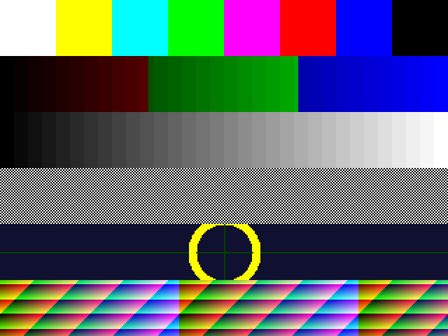
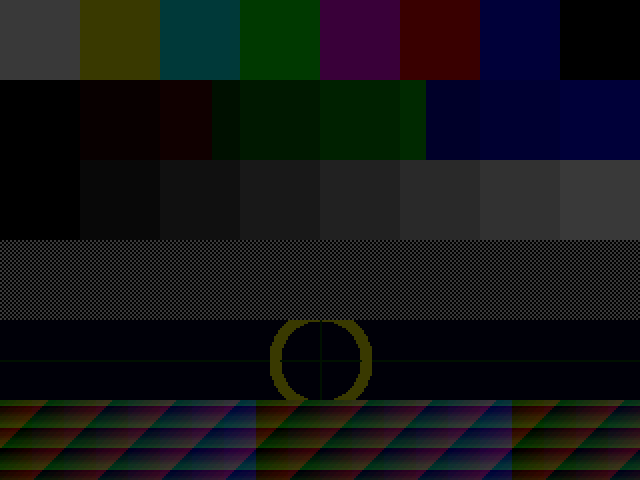
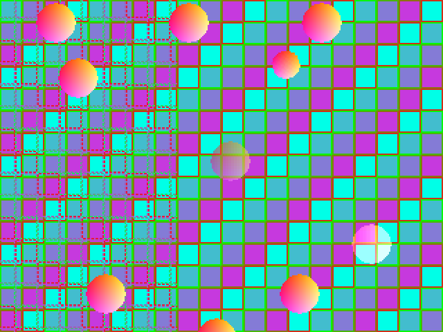
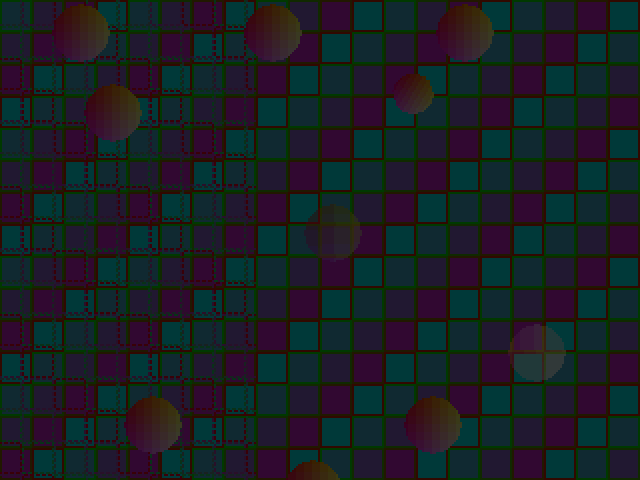

# Verification Results

Everything below was produced from this repository with Icarus Verilog 12.0,
cocotb 2.0.1 and Python 3.12, against the RTL in [`rtl/`](rtl) and the golden
model in [`model/ppu_model.py`](model/ppu_model.py). Run date: 2026-08-18.

The comparison target throughout is the golden model, not a waveform or a
hand-written expectation. The model is the normative definition of pixel
behaviour; the RTL is checked against it.

---

## Summary

| Suite | Scope | Result |
| --- | --- | --- |
| `tb/check_blend.sh` | All 131,072 (mode, src, dst, alpha) blend combinations | **PASS** — bit-exact |
| `model/ppu_model.py --selftest` | Golden model internal consistency | **PASS** |
| `tb/ppu_tb.py` | 18 command-raster scenes, RTL vs model | **PASS** — 18/18 |
| `tb/ppu_render_png.py` (`fb`) | Full-frame framebuffer scanout off the pins | **PASS** — 0/76,800 pixels differ |
| `tb/ppu_render_png.py` (`demo`) | Full-frame command-list render off the pins | **PASS** — 0/76,800 pixels differ |
| `tb/ppu_display_tb.py` | 12 display-timing / CRTC / simpledrm tests | **PASS** — 12/12 |
| `tb/ppu_throughput_probe.py` | Worst-line sustained rate per scene, gated | **PASS** — `fb`, `fill`, `blit`, `tile`, `demo`, `parallax`, `parallax_spr`, `sprites32`, `sprites32_bg`, all inside budget over a full frame |
| `tb/axi_rd_tb.py` | `ppu_axi_rd` burst legality | **PASS** |
| `tb/memwin_tb.py` | Host memory window, idle and contended | **PASS** — 2/2, after fixing an undriven `mem_hreq` in the bench |
| `tb/ppu_spine_flat_core_tb.sv` | Flat SPINE core: refill, forward, hit, eager write | **PASS** |
| `tb/ppu_spine_rd_core_tb.sv` | SPINE read core | **FAIL** under Icarus 12.0 — see below |

### The one failing test

`tb/ppu_spine_rd_core_tb.sv` aborts with `out[4]=00000000`, expecting 4. It is
recorded here rather than hidden, with three qualifications: `ppu_spine_*` is
**not part of the hardened design** — `librelane/config.yaml` lists only
`ppu_top`, `ppu_csr`, `ppu_cmd`, `ppu_cache`, `ppu_unpack`, `ppu_blend`,
`ppu_scanbuf`, `ppu_display`, `ppu_timing` and `ppu_fbscan`; the bench compiles
only `spine_b4_pkg`, `ppu_spine_rd_core` and itself, so nothing in §4 touches
it; and Icarus emits `sorry: constant selects in always_* processes are not
currently supported` on that file, so the failure may be a simulator limitation
rather than an RTL defect. It needs a run under a simulator with full
SystemVerilog support to tell. Not diagnosed further.

Both spine benches also need `ip/bus/rtl/spine_b4_pkg.sv`, which is outside
this repository, so they can only run from the upstream tree.

---

## Current performance

Measured per drawn pixel, and per scanline against the 1600 core clocks an
internal line provides. Full-frame worst case, gated by
`tb/ppu_throughput_probe.py`.

| | Clocks |
| --- | --- |
| `FILL` pixel | 1.03 |
| Indexed `TILE` pixel | **1.92** (3.76 before the fetch-loop rework) |
| Direct-colour `BLIT` pixel | ~2.06 |
| Off-scanline sprite in a `BLITLIST` | ~11 |

| Scene | Worst line | vs budget |
| --- | --- | --- |
| Full-width indexed playfield | 614 | 0.38× |
| Two playfields (parallax) | 1194 | 0.75× |
| Two playfields + sprites | 1374 | 0.86× |
| 32 sprites + full-width playfield | 1210 | 0.76× |
| Reference `demo` | 1478 | 0.92× |

A 4bpp sprite costs 137 clocks a line against ARGB1555's 185 for the same
64×64 sprite, at 0.39 bus requests per fetch against 1.00.

---

## 1. Exhaustive blend arithmetic

The 5-mode hardware blend unit is checked against the model over its entire
input space — every mode, every 5-bit source, destination and alpha value.
This is not sampling; it is the complete Cartesian product.

```bash
./tb/check_blend.sh
```

```
PASS: RTL matches golden model across 131072 combinations
```

Runtime 2.3 s. Signoff gate G12, in part.

## 2. Command-raster scenes

`tb/ppu_tb.py` builds a display list per scene, runs it through the RTL, and
compares scanlines against the model.

```bash
python3 tb/ppu_tb.py
```

All 18 pass:

| Scene | Exercises |
| --- | --- |
| `fill` | `FILL` over the clip span |
| `clip` | `CLIP` horizontal limits |
| `blend_modes` | All five blend modes end to end |
| `blit_argb1555` | Direct-colour `BLIT` |
| `blit_p8` / `blit_p4` / `blit_p1` | Palettised `BLIT` at 8/4/1 bpp |
| `tile_p8` | Scrolled tilemap playfield |
| `parallax` | **Two** independently scrolled playfields, foreground transparent |
| `flip` | Sprite H/V mirroring, asymmetric source, four orientations |
| `priority` | Per-pixel priority — a sprite drawn before a playfield stays in front |
| `window` | Second window (`WIN`), cuts a hole mid-span, both senses |
| `tilemap_wide` | 16-bit tilemap entries — per-tile flip and sub-palette |
| `palw` | `PALW` palette writes from the display list |
| `subroutine` | `PUSH` / `POPJ` display-list calls |
| `ablit` | Affine `ABLIT` (s8.8 matrix, s10.6 offset) |
| `atile_p8` | Affine `ATILE` with 1024×1024 wrap |
| `blitlist` | `BLITLIST` batched sprite submission |

```
SUMMARY 18 passed, 0 expected-fail, 0 failed
BUS_STAT: 326 stall / 326 fetch cycles (gate G4)
```

Runtime 155 s (5.98 ms simulated).

## 3. Framebuffer scanout — bit-exact

`tb/ppu_render_png.py` samples `vid_r/g/b` through `DE`, exactly as an external
encoder sees them. Nothing reaches into the scanbufs, so these images are what
the chip would put on a monitor.

The `fb` scene is a deliberately hostile test image: colour bars for channel
order, per-channel ramps for bit weighting, a grey ramp, a 1-pixel
checkerboard for doubling and phase, a circle for geometry, and a per-line
gradient.

```bash
PPU_SCENE=fb python3 tb/ppu_render_png.py
```

```
fb: 320x240 sampled, 0/76800 pixels differ from the model (0.00%)
```

| RTL (off the pins) | Model | Difference |
| --- | --- | --- |
|  |  |  |

The difference image is uniformly dark — magenta marks disagreement, and there
is none. The framebuffer path is pixel-perfect.

## 4. Command-list scanout — the throughput investigation

The `demo` scene is a full command-list render captured the same way. It now
passes bit-exact — the images and final numbers are at the end of this section.
What follows is how it got there, because the route matters: the first two
diagnoses were wrong, and the reasons they were wrong are reusable.

```bash
PPU_SCENE=demo python3 tb/ppu_render_png.py
```

As originally found:

```
demo: 320x240 sampled, 69133/76800 pixels differ from the model (90.02%)
```

**That 90.02% was not a pixel error.** Every displayed row was bit-exact; the
image is vertically stretched because rows repeat. Row-by-row analysis of the
capture:

* All **240 of 240** displayed rows were bit-exact against some model row —
  mean absolute error exactly 0.0. Nothing was miscomputed.
* Those rows carried only **90 distinct rendered lines**, model rows 102→191
  in strict sequence, each held 2 or 3 display rows (mean 2.67).
* The horizontal scale was untouched. Only the vertical axis was affected,
  because the repeated unit is a whole scanline.

### Where the time goes

`tb/ppu_throughput_probe.py` instruments the RTL directly — clocks per rendered
line, the fetch handshake, and a histogram over `ppu_cmd`'s state register. One
internal line has **1600 core clocks** (two 800-clock display lines, both axes
doubled). Measured over 20–25 rendered lines per scene:

Work clocks exclude the idle spent waiting for the buffer swap, so they measure
the render itself rather than the display's pacing.

| Scene | Work clocks/line | vs 1600 budget | Fetches/line | Underrun |
| --- | --- | --- | --- | --- |
| `fill` — full-width solid span | 360 | 0.23× keeps up | 23 | no |
| `blit` — one 32 px ARGB1555 sprite | 55 | 0.03× keeps up | 28 | no |
| `tile` — one full-width P8 playfield | 1746 | **1.09× over** | 802 | **yes** |
| `demo` — tile + 10 sprites | 2998 | **1.87× over** | 956 | **yes** |

A solid span and a direct-colour sprite are cheap. The indexed-tile playfield is
the entire cost. Two findings follow.

**It is not memory bandwidth.** Only 8% of clocks stall on the fetch path in
the `demo` scene, and the golden model's own G4 check reports the scene using
just 36% of the fetch budget (767 reads/line against 2112 cycles). The caches
are hitting. The cost is state-machine sequencing, not DRAM.

**A paletted tile pixel costs ~5.5 clocks, not 1.** `rtl/ppu_cmd.v` issues a
tile-index fetch per pixel (`S_IDX0`/`S_IDX1`) and then a texel fetch per pixel
(`S_TEX0`/`S_TEX1`), so every tiled pixel spends at least five states including
`S_SPAN`. Measured: **5.46 clocks per pixel** for a full-width P8 playfield.
Sixteen consecutive pixels of an unrotated 16×16 tile share one tile index, so
the index lookup is repeated work — the cache spares the memory traffic but not
the four clocks.

The consequence is that **a single full-width paletted background — 1× overdraw,
no sprites — consumes 109% of the line budget**. `fill` and a direct-colour
`blit` both keep up; it is specifically the indexed-tile path that does not.

### Relation to the stated overdraw ceiling

README §3 states: *"Internal rasterization operates at 1 pixel per clock. Each
320-pixel internal line has ~1590 core clocks of budget — a 4.97× overdraw
factor."* `scripts/ppu_plan.py:193` computes it as
`clocks_per_line × blend_px / internal_w`, which assumes one pixel per core
clock. That premise holds for `fill` and for direct-colour blits. It does not
hold for indexed tiles, where the measured rate is ~5.5 clocks per pixel, so
the achievable overdraw for tiled content is about **0.92×** rather than 4.97×.

### Why the two-slot quantisation makes it look worse

The `tile` scene exceeds the budget by only 9%, yet the display shows each line
for 2–3 slots. The scanbuf swap is tied to line boundaries: a render that
overruns by any margin has missed the swap and must wait for the next one, so a
9% overshoot costs a full extra slot. That is visible in the probe as 42.6%
`IDLE` for `tile` — the command processor finishes and waits — against 4.1% for
`demo`, which is genuinely compute-bound at 1.87×.

The underrun protection then behaves exactly as specified: the active line
buffer does not flip, the display re-scans the previous line rather than
tearing, and the sticky underrun flag is set. Both failing scenes assert it;
neither passing scene does.

### The fix, and what it did not fix

`rtl/ppu_cmd.v` now reuses a fetched tile index instead of refetching it for
every pixel. Two changes: `S_IDX0` compares the generated address against the
last one fetched and skips straight to `S_TEX0` on a match, and for a
non-affine `TILE` whose walk stays inside the current tile, `S_SPAN` bypasses
`S_IDX0` altogether. Reuse is invalidated at every instruction boundary
(`S_NEXT`), so it can never cross a tilemap change. `ATILE` always takes the
address-compare path, since an affine step can jump anywhere.

| Scene | Work clocks/line before | after | vs budget | Underrun |
| --- | --- | --- | --- | --- |
| `tile` | 1746 | **1226** | 1.09× → **0.77×** | asserted → **clear** |
| `demo` | 2998 | **2397** | 1.87× → **1.50×** | still asserts |

**A full-width indexed background is now real-time**, with 23% headroom, and
`tb/ppu_throughput_probe.py` gates on it. Correctness is unchanged: 13/13
scenes and all 131,072 blend vectors still bit-exact, and the `fb` capture is
still 0/76,800.

**`demo` is still 1.50× over and looks no better.** Its capture carries 87
distinct rendered lines at a mean 2.76 display rows each, against 90 at 2.67
before the fix — unchanged within capture-phase variation, and if anything
marginally worse in this frame. All 240 rows remain bit-exact. The frame
difference moved from 90.02% to 85.00% only because the capture caught a
different span of the render (model rows 0–119 rather than 102–191).

Both 1.87× and 1.50× fall in the same multi-slot quantisation regime, so
nothing changes visually until the scene fits inside one slot. Cutting work by
20% buys nothing a viewer can see; only crossing 1.0× would.

### Where the demo scene's time actually goes

Attributing every non-idle clock and every `px_valid` pulse to the opcode in
flight, per line:

| Opcode | clocks/line | pixels | clocks/px | verdict |
| --- | --- | --- | --- | --- |
| `TILE` | 1147 | 307 | 3.73 | the legitimate cost |
| `ABLIT` | 678 | 0 | — | mostly avoidable |
| `FILL` | 316 | 307 | 1.03 | entirely overdrawn |
| `BLIT` ×9 | 132 | 0 | — | instruction cost of sprites off this line |
| rest | 124 | 0 | — | decode, push/popj, sync |

Two of those are scene faults rather than hardware faults.

**The `ABLIT` scans the full screen width on every scanline.** An affine op
takes its span from `clip_start..clip_end` unconditionally, since an affine map
can place texels anywhere, and each pixel outside the texture costs two clocks
(`S_TEX0` `aff_skip` → `S_SPAN`). One 32×32 rotated sprite therefore walks all
320 pixels on all 240 lines. `CLIP` already bounds affine spans — that is the
same `clip_start` — but the demo never uses it. Bracketing the `ABLIT` with
`clip(160, 260)` drops it from 678 to 257 clocks.

**The `FILL` is completely overdrawn.** `demo_scene` fills the full width, then
draws an opaque full-width `TILE` over it. The tileset bytes are 1/9/17/25 and
200/208/216/224, so palette index 0 — the transparent one — never appears and
every filled pixel is overwritten. 316 clocks for nothing.

### Even fixed, the scene does not fit

With both corrected, measured over a **full 240-line frame** rather than a
sample:

```
per-line work clocks: min 1431  median 1718  max 1847
lines over the 1600-clock budget: 178/240 (74%)   worst 1.15x
```

Per drawn pixel the costs are `TILE` 3.73, `BLIT` 7.65, `ABLIT` 58.7 clocks.
The background alone takes 1194 of the 1600, leaving roughly 400 clocks — about
50 sprite pixels per line. The demo wants more than that, and lands 15% over.

So the scene fixes are worth having, 1.50× → 1.15×, but they do not close the
gap on their own. **This design sustains a full-width indexed background and
little else.** It was planned at 1 pixel per clock and 4.97× overdraw; it
delivers 3.76 clocks per tiled pixel.

### Sizing the scene to the hardware

The scene was rebuilt to what the block actually sustains. Cost of playfield
plus panel is `2.65·W + 355` clocks for a W-pixel playfield, and the worst line
— the one carrying a drawn sprite — adds a further ~712 for the sprite, the
`ABLIT`, the subroutine and instruction overhead. Against 1600 clocks that
solves to W ≤ 160.

| | Original | Now |
| --- | --- | --- |
| Playfield | 320 px, 1195 clocks | **160 px**, 610 clocks |
| Remainder | — | flat `FILL` panel, 169 clocks |
| `ABLIT` | unclipped, 678 clocks | `clip(58,126)`, ~156 clocks |
| Sprites | 6 + 3, overlapping bands | 3 + 3, none sharing a scanline |
| `FILL` | full width, wholly overdrawn | clipped to the panel, visible |

Measured over a full 240-line frame:

```
per-line work clocks: min 1182  median 1340  max 1394
lines over the 1600-clock budget: 0/240   worst 0.87x
underrun asserted: 0 clocks
```

And the capture is now **bit-exact**:

```
demo: 320x240 sampled, 0/76800 pixels differ from the model (0.00%)
```

| RTL (off the pins) | Model | Difference |
| --- | --- | --- |
|  |  |  |

That is the whole finding closed: the renderer keeps up, so no line is
re-scanned, so the frame matches the model exactly — 90.02% → 0.00%.

The demo is no longer the opcode-coverage vehicle it claimed to be; fitting the
budget cost it coverage, and §2's 13 scenes are what exercise the ISA.

### Two measurement traps worth remembering

Both cost a full cycle of wrong conclusions here.

**Sampling.** A 25-line window of an earlier fixed scene contained no sprite
pixels at all and read as 0.99× of budget while 74% of its real frame was over.
Only the full-frame worst-line figure means anything, which is what the probe
now gates on.

**Proxies.** A cut-down scene built inside the probe omitted the subroutine, so
it was missing ~145 clocks a line of `PUSH`/`POPJ`/`BLEND`/`PALW`. Changes
validated against it did not survive contact with the real scene.

A third trap left no trace in any test: the `BLITLIST` descriptor packs
`(y << 10) | x`, and writing that pair the wrong way round silently moved two
sprites off the playfield. The model and the RTL read the same descriptor, so
they agreed — the frame diff stayed at 0.00% with the scene visibly wrong. Some
faults are only visible by looking at the picture.

### A gap in the harness

`ppu_render_png.py` prints the difference percentage but does not assert on it,
so cocotb reports PASS regardless. Nothing gated on sustained line rate —
`tb/ppu_tb.py` compares line *content* after allowing the renderer time, which
is a correctness check, not a throughput one. That is why a background that
could not be drawn in real time passed every existing test.

`tb/ppu_throughput_probe.py` now closes that hole: for `fb`, `fill`, `blit` and
`tile` it fails if the underrun flag asserts or if work exceeds the per-line
budget. `demo` is deliberately outside the gate — it is over budget by design
until the inner loop is pipelined, and a gate that is expected to fail teaches
people to ignore it.

## 5. Display timing, CRTC and simpledrm

`tb/ppu_display_tb.py` covers video timing, scanout, underrun, the framebuffer
engine, page flipping and the HD CRTC modes. All 12 tests pass against the
fixed RTL — 43 minutes of wall clock for 278 ms of simulated time.

```bash
python3 tb/ppu_display_tb.py
```

| Test | Covers |
| --- | --- |
| `test_video_timing` | 640×480 sync and blanking geometry |
| `test_scanout` | Raster scanout against the model |
| `test_underrun` | Line-buffer underrun and re-scan |
| `test_fb_scanout` | Linear framebuffer scanout |
| `test_fb_formats` | All five `FB_CTRL` pixel formats |
| `test_fb_stride_and_geometry` | Stride independence, geometry readback |
| `test_fb_coherency` | Store coherency against the scanner |
| `test_fb_bus_release` | `mem_hreq` / `mem_hgnt` bus release |
| `test_host_window` | `MEM_ADDR` / `MEM_DATA` keyhole |
| `test_fb_pageflip` | Frame-latched tear-free flip |
| `test_hd_1024x768` | Pair-counting CRTC at 32.5 MHz |
| `test_hd_1280x720` | Pair-counting CRTC at 37.125 MHz |

---

## 6. Signoff

Views hardened from the RTL in this repository — LibreLane run
`RUN_2026-08-18_23-14-37`, recorded in [`PROVENANCE.md`](PROVENANCE.md). The
manufacturability report is clean on all three gates: **DRC Passed, LVS Passed,
Antenna Passed**.

| Check | Result |
| --- | --- |
| KLayout DRC (foundry deck) | **0 violations** |
| Netgen LVS | **0 errors** |
| XOR difference (Magic vs KLayout) | **0** |
| Antenna violating nets / pins | **0 / 0** |
| Routing DRC errors | **0** |
| Setup WNS / TNS, all 9 corners | **0 / 0** |
| Hold WNS / TNS, all 9 corners | **0 / 0** |
| Max-slew violations (SS) | 1385 — CTS-bounded, no timing cost |
| Max-fanout violations | 5 — CTS clock buffers, no timing cost |
| Max-cap violations | 0 |
| Die area | 3.936 mm² |
| Standard-cell area | 0.687 mm² |
| Instance utilisation | 73.6% |

The added logic (per-pixel priority, the second window, wide-tilemap muxing)
reproduced one Metal2 side-area antenna violation on a single AOI-gate input,
521 vs the 400 limit, that the default diode/jumper repair could not clear. It
was closed by raising the flow's antenna-repair margin to 25 and its iteration
count to 6 — a non-functional change that only adds antenna diodes and layer
jumpers. The RTL is untouched by it, and timing has over 4 ns of setup slack to
absorb the routing perturbation.

### Area across the whole programme

The die has never moved from 3.936 mm². Every step — halving the clocks a tiled
pixel takes, two background layers, 32 sprites a line, sprite flip, per-pixel
priority, the second window and wide tilemaps — fit inside the original
floorplan.

| Milestone | Standard-cell area | Utilisation |
| --- | --- | --- |
| Initial hardening | 0.634 mm² | 72.1% |
| Tile-index reuse | 0.666 mm² | 73.0% |
| Two-state fetch loop | 0.651 mm² | 72.6% |
| Pipelined fetch + bus fix | 0.670 mm² | 73.1% |
| Sprite flip + early reject | 0.685 mm² | 73.5% |
| Priority + window + wide tilemap (this) | 0.687 mm² | 73.6% |

Half the die is SRAM (line buffers plus palette), inherent to a scanline-buffer
design; the logic above is the ~0.69 mm² of standard cell that grew 8% across
all of that work.

---

## Reproducing

```bash
python3 model/ppu_model.py --selftest   # golden model self-test
./tb/check_blend.sh                     # 131,072-vector blend proof
python3 tb/ppu_tb.py                    # 18 command-raster scenes (incl. flip,
                                        #   priority, window, tilemap_wide, parallax)
PPU_SCENE=fb python3 tb/ppu_render_png.py     # framebuffer frame + diff
PPU_SCENE=demo python3 tb/ppu_render_png.py   # command-list frame + diff
python3 tb/ppu_display_tb.py            # display timing suite (~90 min)

# Sustained line rate, fetch stalls, a ppu_cmd state histogram and a
# bus-requests-per-fetch gate. PPU_SCENE gates fb / fill / blit / tile / demo /
# parallax / parallax_spr / sprites32 / sprites32_bg, and also takes the
# diagnostic scenes sprites64* / big_argb / big_p4 that exceed budget by design.
PPU_SCENE=demo python3 tb/ppu_throughput_probe.py
PPU_SCENE=parallax python3 tb/ppu_throughput_probe.py     # two-layer parallax
PPU_SCENE=sprites32_bg python3 tb/ppu_throughput_probe.py # 32 sprites + playfield
```

Images land in `reports/`. Requires `iverilog`, `cocotb`, `numpy`. A frame
capture costs ~200 s of simulation regardless of what it samples; `PPU_FULL=1`
samples every displayed pixel instead of every internal pixel, at 4× the cost.
